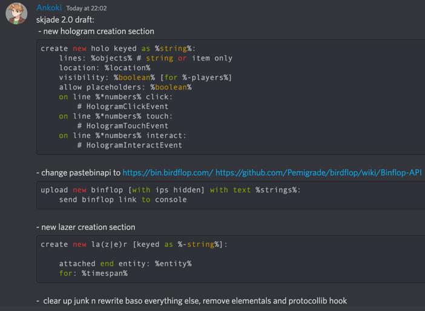

# SkJade
A Skript Addon which provides useful hooks and utilities to Skript.

SkJade is getting a revamp (in my disky arc ig), hence this branch being created. Here are my proposed features which im going to implement.  
This might take a while so any bug fixes wont be addressed and instead ported to this branch.  
2.0 will require Skript-2.6, as I will be using the SectionAPI. 

# Documentation

You can find documentation on SkriptHub or SkUnity!  
  

I will also add tutorials on how to use 
seperate parts of SkJade to the wiki at some point, however when that point will be is a good question that I will not
answer. ❤